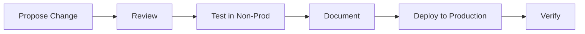

# Infrastructure Automation – LMS

## Overview

This directory contains **infrastructure-level automation** for the Faculty Leave Management System (LMS).

### Purpose

The purpose of this folder is to manage:

- Backups and data retention
- Disaster recovery procedures
- Off-site synchronization
- Infrastructure monitoring

All content here is **independent of application logic** and is designed to function even if the LMS application is unavailable.

---

## Scope

This directory covers **infrastructure responsibilities only**.

### ✅ Included

- Database backup automation
- Application and configuration backups
- Archive jobs
- Backup verification
- Cleanup and retention enforcement
- Disaster recovery documentation

### ❌ Excluded

- Business logic
- Application-level cron jobs
- Express / React code
- CI/CD pipelines

---

## Directory Structure

```text
infra/
├── backup/
│   ├── scripts/          # Backup, cleanup, archive scripts
│   ├── cron/             # Cron schedule examples
│   ├── env/              # Environment variable templates
│   └── docs/             # Recovery and policy documents
│
└── monitoring/           # Infrastructure monitoring scripts
```

---

## Security Guidelines

> ⚠️ **CRITICAL**: Violation of these rules is considered a security risk.

- ❌ **No secrets** must be committed to this repository
- ✅ Environment files must use `.env.example` format only
- ✅ Production secrets must be stored securely on the server
- ✅ File permissions must be restricted for executable scripts

### Example: Proper Environment File Usage

**Incorrect** ❌:
```bash
# .env (committed to repo)
DB_PASSWORD=mySecretPassword123
```

**Correct** ✅:
```bash
# .env.example (committed to repo)
DB_PASSWORD=your_secure_password_here
```

---

## Deployment Model

Infrastructure scripts are:

- ✅ Versioned in GitHub
- ✅ Deployed manually or via secure copy to the server
- ✅ Executed via system cron jobs
- ✅ Independent of application deployment cycles

### Example Deployment Path

```bash
/opt/lms-backup/
```

### Deployment Steps

1. Clone or pull the latest infrastructure repository
2. Copy scripts to `/opt/lms-backup/`
3. Set appropriate permissions:
   ```bash
   chmod 700 /opt/lms-backup/scripts/*.sh
   ```
4. Configure environment variables on the server
5. Update cron jobs if needed

---

## Operational Principles

| Principle | Requirement |
|-----------|-------------|
| **Automation** | Backups must be automated |
| **Cleanup** | Cleanup must be time-based |
| **Testing** | Restore must be tested periodically |
| **Redundancy** | Off-site copies must always exist |
| **Logging** | Failures must be logged and investigated |

---

## Ownership & Responsibility

This directory is owned by:

- **LMS System Administrator**
- **Infrastructure Maintainer**

> ⚠️ **Unauthorized modifications are prohibited.**

---

## Change Management

Any changes to infrastructure scripts or policies must:

1. ✅ Be reviewed before deployment
2. ✅ Be tested in a non-production environment
3. ✅ Be documented in change logs

### Change Request Process



---

## Quick Start

### Setting Up Infrastructure Automation

1. **Clone the repository:**
   ```bash
   git clone <INFRA_REPO_URL>
   cd infra
   ```

2. **Deploy scripts to server:**
   ```bash
   sudo mkdir -p /opt/lms-backup
   sudo cp backup/scripts/* /opt/lms-backup/
   sudo chmod 700 /opt/lms-backup/*.sh
   ```

3. **Configure environment:**
   ```bash
   sudo nano /etc/lms-backup.env
   # Add required variables
   sudo chmod 600 /etc/lms-backup.env
   ```

4. **Set up cron jobs:**
   ```bash
   crontab backup/cron/crontab.example
   ```

5. **Verify setup:**
   ```bash
   sudo /opt/lms-backup/backup-db.sh --test
   ```

---

## Documentation Reference

| Document | Location | Purpose |
|----------|----------|---------|
| Disaster Recovery Plan | `backup/docs/disaster-recovery-plan.md` | Full DR procedures |
| Restore Procedure | `backup/docs/restore-procedure.md` | Quick restore steps |
| Backup Policy | `backup/docs/backup-policy.md` | Retention and schedules |
| Monitoring Guide | `monitoring/docs/monitoring-guide.md` | Infrastructure monitoring |

---

## Support & Contact

For infrastructure-related issues:

| Issue Type | Contact |
|------------|---------|
| Backup failures | System Administrator |
| Script errors | Infrastructure Maintainer |
| Security concerns | Security Team |
| General questions | LMS Support |

---

## Version History

| Version | Date | Author | Changes |
|---------|------|--------|---------|
| 1.0 | 2026-02 | Infrastructure Team | Initial version |

---

**Last Updated:** February 2026  
**Maintained By:** LMS Infrastructure Team  
**Repository:** `infra/`